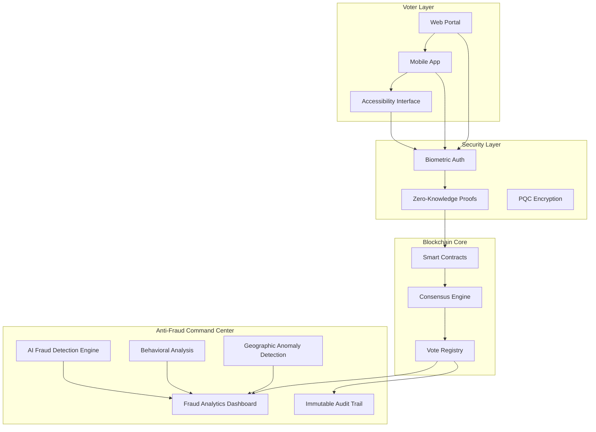
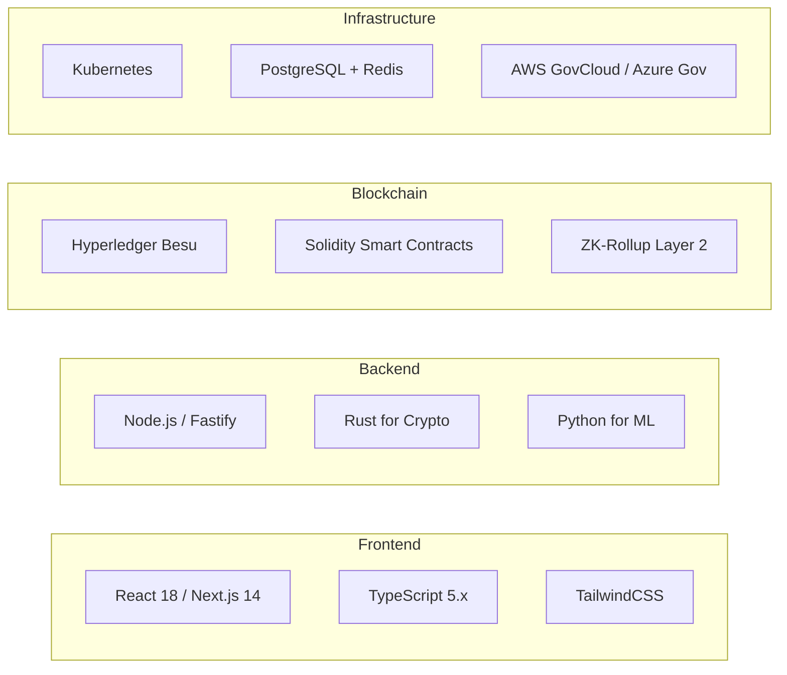
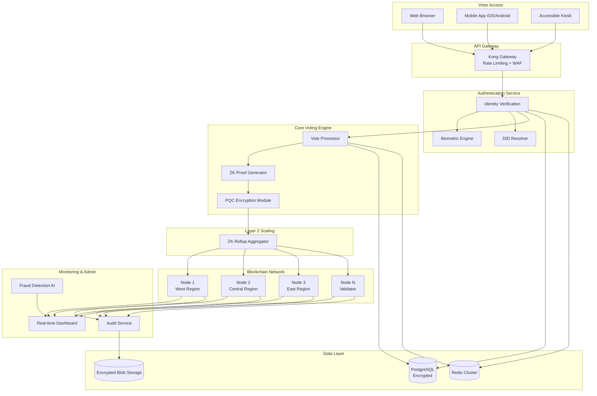
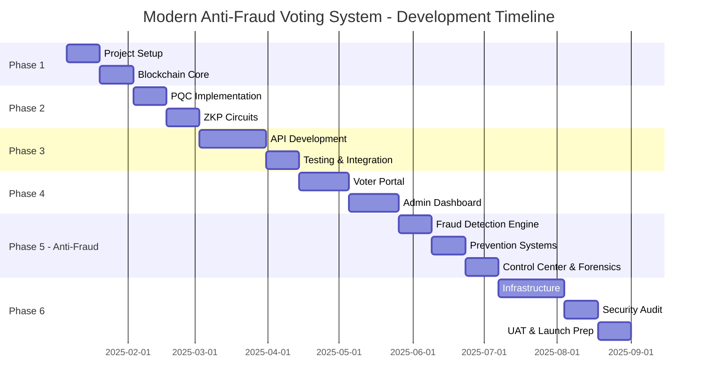

# Modern Anti-Fraud Voting System

A next-generation, enterprise-grade blockchain voting platform designed for US government elections with **advanced anti-fraud analytics**, post-quantum cryptography, zero-knowledge proofs, and real-time fraud detection & control capabilities.

---

## Executive Summary

This project implements a **production-ready blockchain-based voting system** that addresses the critical requirements of scale (100M+ voters), integrity (cryptographic verifiability), privacy (anonymous yet auditable), and future-proofing (quantum-resistant algorithms).



---

## Suggested Features (Beyond Your Requirements)

> [!IMPORTANT]
> The following advanced features are recommended to ensure the system meets government-grade requirements:

### 🔐 Security & Cryptography

| Feature                       | Description                                              | Priority |
| ----------------------------- | -------------------------------------------------------- | -------- |
| **NIST PQC Standards**        | ML-KEM (FIPS 203), ML-DSA (FIPS 204), SLH-DSA (FIPS 205) | Critical |
| **Zero-Knowledge Proofs**     | zk-SNARKs for anonymous verifiable voting                | Critical |
| **Homomorphic Encryption**    | Encrypted vote tallying without decryption               | High     |
| **Multi-Party Computation**   | Distributed key generation for election keys             | High     |
| **Hardware Security Modules** | HSM integration for key management                       | Critical |

### 🧬 Identity & Authentication

| Feature                          | Description                                 | Priority |
| -------------------------------- | ------------------------------------------- | -------- |
| **Decentralized Identity (DID)** | W3C DID standard for voter credentials      | Critical |
| **Biometric Verification**       | Face ID, fingerprint, voice recognition     | High     |
| **Multi-Factor Authentication**  | Government ID + biometric + one-time codes  | Critical |
| **Sybil Attack Prevention**      | Proof of personhood with liveness detection | Critical |

### 🚨 Anti-Fraud Analytics & Control (NEW - COMPREHENSIVE)

| Feature                           | Description                                                      | Priority |
| --------------------------------- | ---------------------------------------------------------------- | -------- |
| **Real-time Anomaly Detection**   | ML-powered detection of statistical anomalies in voting patterns | Critical |
| **Behavioral Biometrics**         | Mouse movement, typing patterns, device fingerprinting           | Critical |
| **Geographic Fraud Analysis**     | Impossible travel detection, location spoofing prevention        | Critical |
| **Double-Voting Prevention**      | Cross-jurisdictional duplicate detection with bloom filters      | Critical |
| **Bot & Automation Detection**    | CAPTCHA-less bot detection using behavioral signals              | Critical |
| **Temporal Pattern Analysis**     | Detection of coordinated voting waves and timing attacks         | High     |
| **Network Graph Analysis**        | Detection of organized fraud rings and collusion                 | High     |
| **Device Risk Scoring**           | Real-time risk assessment of voter devices                       | High     |
| **IP Reputation & VPN Detection** | Block suspicious IPs, detect proxy/VPN usage                     | High     |
| **Voter Velocity Monitoring**     | Track voting speed anomalies per jurisdiction                    | High     |
| **Live Fraud Control Dashboard**  | Real-time intervention capabilities for election officials       | Critical |
| **Automated Alert Escalation**    | Tiered alerting with automatic incident creation                 | High     |
| **Forensic Investigation Tools**  | Post-election deep-dive analysis capabilities                    | High     |
| **Compliance Reporting**          | Automated fraud prevention compliance reports                    | High     |

### 📊 Monitoring & Observability

| Feature                         | Description                                   | Priority |
| ------------------------------- | --------------------------------------------- | -------- |
| **Real-time Analytics**         | Live vote count, turnout, geographic heatmaps | High     |
| **Distributed Tracing**         | OpenTelemetry for end-to-end observability    | Medium   |
| **Predictive Traffic Modeling** | Load prediction and auto-scaling              | Medium   |

### 🌐 Scalability & Performance

| Feature                 | Description                         | Priority |
| ----------------------- | ----------------------------------- | -------- |
| **Layer-2 Rollups**     | ZK-rollups for 10,000+ TPS          | Critical |
| **Geographic Sharding** | State-level blockchain partitions   | High     |
| **Edge Computing**      | Edge nodes for low-latency voting   | Medium   |
| **Offline Voting**      | Encrypted offline ballots with sync | Medium   |

### ♿ Accessibility & Inclusion

| Feature                       | Description                            | Priority |
| ----------------------------- | -------------------------------------- | -------- |
| **WCAG 2.2 AAA Compliance**   | Full accessibility for disabled voters | Critical |
| **Multi-language Support**    | 50+ languages including indigenous     | High     |
| **Voice-Guided Voting**       | Audio interface for visually impaired  | High     |
| **Simplified Interface Mode** | Large text, high contrast options      | High     |

### 🔮 Quantum Computing Integration

| Feature                              | Description                                  | Priority |
| ------------------------------------ | -------------------------------------------- | -------- |
| **Quantum Random Number Generation** | True randomness for cryptographic operations | Medium   |
| **Quantum Key Distribution (QKD)**   | Future-ready quantum-secure channels         | Future   |
| **Quantum-Safe Algorithms**          | Crypto-agility for algorithm migration       | Critical |

---

## Technology Stack

### Core Technologies



| Layer                   | Technology                             | Rationale                                   |
| ----------------------- | -------------------------------------- | ------------------------------------------- |
| **Blockchain**          | Hyperledger Besu (Ethereum-compatible) | Permissioned network, government compliance |
| **Smart Contracts**     | Solidity + Vyper                       | Auditable, well-tested                      |
| **Post-Quantum Crypto** | liboqs (Open Quantum Safe)             | NIST-approved algorithms                    |
| **ZK Proofs**           | Circom + SnarkJS / Noir                | Efficient zk-SNARKs                         |
| **Backend**             | Node.js + Rust                         | Performance + safety                        |
| **Frontend**            | Next.js 14 + React                     | SSR, accessibility                          |
| **Database**            | PostgreSQL + Redis                     | ACID compliance + speed                     |
| **ML/AI**               | Python + PyTorch                       | Fraud detection models                      |
| **Infrastructure**      | Kubernetes on GovCloud                 | FedRAMP compliant                           |

---

## System Architecture

### High-Level Architecture



---

## Proposed Project Structure

```
modern-antifraud-voting/
├── packages/
│   ├── blockchain/               # Blockchain core
│   │   ├── contracts/            # Solidity smart contracts
│   │   ├── scripts/              # Deployment scripts
│   │   └── test/                 # Contract tests
│   │
│   ├── crypto/                   # Cryptography module
│   │   ├── pqc/                  # Post-quantum algorithms (Rust)
│   │   ├── zkp/                  # Zero-knowledge proofs
│   │   └── homomorphic/          # Homomorphic encryption
│   │
│   ├── antifraud/                # 🚨 ANTI-FRAUD ANALYTICS & CONTROL
│   │   ├── detection/            # Real-time fraud detection
│   │   │   ├── anomaly/          # Statistical anomaly detection
│   │   │   ├── behavioral/       # Behavioral biometrics
│   │   │   ├── geographic/       # Location-based fraud detection
│   │   │   ├── temporal/         # Time-based pattern analysis
│   │   │   └── network/          # Graph-based fraud ring detection
│   │   ├── prevention/           # Fraud prevention systems
│   │   │   ├── deduplication/    # Double-voting prevention
│   │   │   ├── bot-detection/    # Bot & automation blocking
│   │   │   └── device-risk/      # Device fingerprinting & risk scoring
│   │   ├── control/              # Fraud control & response
│   │   │   ├── dashboard/        # Live fraud control dashboard
│   │   │   ├── alerts/           # Alert management & escalation
│   │   │   └── intervention/     # Manual intervention tools
│   │   ├── forensics/            # Post-election investigation
│   │   │   ├── analysis/         # Deep-dive analysis tools
│   │   │   └── reporting/        # Compliance & fraud reports
│   │   └── models/               # ML models for fraud detection
│   │       ├── ensemble/         # Ensemble fraud scoring
│   │       ├── isolation-forest/ # Anomaly detection
│   │       └── graph-nn/         # Graph neural networks
│   │
│   ├── api/                      # Backend API
│   │   ├── src/
│   │   │   ├── auth/             # Authentication service
│   │   │   ├── voting/           # Voting service
│   │   │   ├── antifraud/        # Anti-fraud API endpoints
│   │   │   ├── audit/            # Audit logging
│   │   │   └── monitoring/       # Health & metrics
│   │   └── test/
│   │
│   ├── web/                      # Voter web portal
│   │   ├── app/                  # Next.js app router
│   │   ├── components/           # React components
│   │   └── lib/                  # Utilities
│   │
│   ├── admin/                    # Admin dashboard
│   │   ├── app/
│   │   │   ├── dashboard/        # Main monitoring dashboard
│   │   │   ├── fraud-center/     # 🚨 Fraud command center
│   │   │   ├── investigations/   # Fraud investigation UI
│   │   │   └── reports/          # Compliance reports
│   │   └── components/
│   │
│   └── ml/                       # Machine learning
│       ├── fraud_detection/      # Fraud detection models
│       ├── behavior_analysis/    # Behavioral biometrics ML
│       └── traffic_prediction/   # Load forecasting
│
├── infrastructure/
│   ├── kubernetes/               # K8s manifests
│   ├── terraform/                # IaC for GovCloud
│   └── helm/                     # Helm charts
│
├── docs/
│   ├── architecture/             # Architecture Decision Records
│   ├── security/                 # Security documentation
│   ├── antifraud/                # Anti-fraud system docs
│   └── compliance/               # FedRAMP, CISA docs
│
└── scripts/                      # Build & deployment scripts
```

---

## Proposed Changes

### Phase 1: Foundation (Weeks 1-4)

---

#### [NEW] Project Configuration

##### [NEW] [package.json](file:///Users/jordan_mbp/.gemini/antigravity/playground/primal-sojourner/package.json)

- Monorepo workspace configuration using pnpm
- Shared dependencies and scripts

##### [NEW] [pnpm-workspace.yaml](file:///Users/jordan_mbp/.gemini/antigravity/playground/primal-sojourner/pnpm-workspace.yaml)

- Package workspace definitions

##### [NEW] [tsconfig.json](file:///Users/jordan_mbp/.gemini/antigravity/playground/primal-sojourner/tsconfig.json)

- TypeScript configuration with strict mode

---

#### [NEW] Blockchain Core (`packages/blockchain/`)

##### [NEW] [VoteRegistry.sol](file:///Users/jordan_mbp/.gemini/antigravity/playground/primal-sojourner/packages/blockchain/contracts/VoteRegistry.sol)

- Core voting smart contract
- Election creation, voter registration, vote casting
- Cryptographic vote verification

##### [NEW] [ElectionManager.sol](file:///Users/jordan_mbp/.gemini/antigravity/playground/primal-sojourner/packages/blockchain/contracts/ElectionManager.sol)

- Election lifecycle management
- Candidate registration
- Results aggregation

##### [NEW] [AccessControl.sol](file:///Users/jordan_mbp/.gemini/antigravity/playground/primal-sojourner/packages/blockchain/contracts/AccessControl.sol)

- Role-based access control
- Admin, auditor, election official roles

##### [NEW] [hardhat.config.ts](file:///Users/jordan_mbp/.gemini/antigravity/playground/primal-sojourner/packages/blockchain/hardhat.config.ts)

- Hardhat configuration for contract development
- Network configurations for testnet and Besu

---

### Phase 2: Cryptography (Weeks 5-8)

---

#### [NEW] Post-Quantum Cryptography (`packages/crypto/pqc/`)

##### [NEW] [lib.rs](file:///Users/jordan_mbp/.gemini/antigravity/playground/primal-sojourner/packages/crypto/pqc/src/lib.rs)

- Rust crate for NIST PQC algorithms
- ML-KEM (Kyber) key encapsulation
- ML-DSA (Dilithium) digital signatures
- SLH-DSA (SPHINCS+) signatures

##### [NEW] [keygen.rs](file:///Users/jordan_mbp/.gemini/antigravity/playground/primal-sojourner/packages/crypto/pqc/src/keygen.rs)

- Key generation utilities
- Secure random number generation

##### [NEW] [binding.ts](file:///Users/jordan_mbp/.gemini/antigravity/playground/primal-sojourner/packages/crypto/pqc/binding.ts)

- Node.js bindings via NAPI-RS
- TypeScript type definitions

---

#### [NEW] Zero-Knowledge Proofs (`packages/crypto/zkp/`)

##### [NEW] [vote_validity.circom](file:///Users/jordan_mbp/.gemini/antigravity/playground/primal-sojourner/packages/crypto/zkp/circuits/vote_validity.circom)

- zk-SNARK circuit for vote validity proof
- Proves vote is valid without revealing choice

##### [NEW] [voter_eligibility.circom](file:///Users/jordan_mbp/.gemini/antigravity/playground/primal-sojourner/packages/crypto/zkp/circuits/voter_eligibility.circom)

- Proves voter is eligible without revealing identity

##### [NEW] [prover.ts](file:///Users/jordan_mbp/.gemini/antigravity/playground/primal-sojourner/packages/crypto/zkp/src/prover.ts)

- ZK proof generation service
- SnarkJS integration

##### [NEW] [verifier.ts](file:///Users/jordan_mbp/.gemini/antigravity/playground/primal-sojourner/packages/crypto/zkp/src/verifier.ts)

- On-chain and off-chain proof verification

---

### Phase 3: Backend Services (Weeks 9-14)

---

#### [NEW] API Server (`packages/api/`)

##### [NEW] [app.ts](file:///Users/jordan_mbp/.gemini/antigravity/playground/primal-sojourner/packages/api/src/app.ts)

- Fastify application setup
- Middleware configuration

##### [NEW] [auth/service.ts](file:///Users/jordan_mbp/.gemini/antigravity/playground/primal-sojourner/packages/api/src/auth/service.ts)

- Authentication service
- DID verification, biometric validation
- MFA token management

##### [NEW] [voting/service.ts](file:///Users/jordan_mbp/.gemini/antigravity/playground/primal-sojourner/packages/api/src/voting/service.ts)

- Vote submission and validation
- ZK proof verification
- Blockchain transaction submission

##### [NEW] [audit/service.ts](file:///Users/jordan_mbp/.gemini/antigravity/playground/primal-sojourner/packages/api/src/audit/service.ts)

- Immutable audit logging
- Compliance reporting

##### [NEW] [monitoring/metrics.ts](file:///Users/jordan_mbp/.gemini/antigravity/playground/primal-sojourner/packages/api/src/monitoring/metrics.ts)

- Prometheus metrics
- OpenTelemetry tracing

---

### Phase 4: Frontend (Weeks 15-20)

---

#### [NEW] Voter Portal (`packages/web/`)

##### [NEW] [app/page.tsx](file:///Users/jordan_mbp/.gemini/antigravity/playground/primal-sojourner/packages/web/app/page.tsx)

- Landing page with election information
- Modern glassmorphism design

##### [NEW] [app/vote/page.tsx](file:///Users/jordan_mbp/.gemini/antigravity/playground/primal-sojourner/packages/web/app/vote/page.tsx)

- Voting interface
- Ballot display and selection
- Vote confirmation

##### [NEW] [app/verify/page.tsx](file:///Users/jordan_mbp/.gemini/antigravity/playground/primal-sojourner/packages/web/app/verify/page.tsx)

- Vote verification page
- QR code scanning
- Blockchain receipt validation

##### [NEW] [components/AccessibilityPanel.tsx](file:///Users/jordan_mbp/.gemini/antigravity/playground/primal-sojourner/packages/web/components/AccessibilityPanel.tsx)

- Accessibility controls
- Font size, contrast, voice guidance

---

#### [NEW] Admin Dashboard (`packages/admin/`)

##### [NEW] [app/dashboard/page.tsx](file:///Users/jordan_mbp/.gemini/antigravity/playground/primal-sojourner/packages/admin/app/dashboard/page.tsx)

- Real-time election monitoring
- Geographic heatmaps
- Voter turnout analytics

##### [NEW] [app/audit/page.tsx](file:///Users/jordan_mbp/.gemini/antigravity/playground/primal-sojourner/packages/admin/app/audit/page.tsx)

- Audit log viewer
- Compliance reports

##### [NEW] [app/alerts/page.tsx](file:///Users/jordan_mbp/.gemini/antigravity/playground/primal-sojourner/packages/admin/app/alerts/page.tsx)

- Fraud detection alerts
- Anomaly notifications

---

### Phase 5: Anti-Fraud Analytics & Control (Weeks 21-26)

---

#### [NEW] Anti-Fraud Detection Engine (`packages/antifraud/detection/`)

##### [NEW] [anomaly/statistical_detector.py](file:///Users/jordan_mbp/.gemini/antigravity/playground/primal-sojourner/packages/antifraud/detection/anomaly/statistical_detector.py)

- Isolation Forest for outlier detection
- Z-score analysis for voting pattern anomalies
- Benford's Law analysis for vote distribution

##### [NEW] [behavioral/biometric_analyzer.ts](file:///Users/jordan_mbp/.gemini/antigravity/playground/primal-sojourner/packages/antifraud/detection/behavioral/biometric_analyzer.ts)

- Mouse movement pattern analysis
- Keystroke dynamics profiling
- Session behavior fingerprinting
- Human vs bot classification

##### [NEW] [geographic/location_validator.ts](file:///Users/jordan_mbp/.gemini/antigravity/playground/primal-sojourner/packages/antifraud/detection/geographic/location_validator.ts)

- IP geolocation verification
- Impossible travel detection
- GPS spoofing detection
- VPN/Proxy identification

##### [NEW] [temporal/pattern_analyzer.py](file:///Users/jordan_mbp/.gemini/antigravity/playground/primal-sojourner/packages/antifraud/detection/temporal/pattern_analyzer.py)

- Voting wave detection
- Time-of-day anomaly analysis
- Coordinated attack identification

##### [NEW] [network/graph_analyzer.py](file:///Users/jordan_mbp/.gemini/antigravity/playground/primal-sojourner/packages/antifraud/detection/network/graph_analyzer.py)

- Graph neural network for fraud ring detection
- Voter relationship mapping
- Collusion pattern identification

---

#### [NEW] Fraud Prevention (`packages/antifraud/prevention/`)

##### [NEW] [deduplication/bloom_filter.rs](file:///Users/jordan_mbp/.gemini/antigravity/playground/primal-sojourner/packages/antifraud/prevention/deduplication/bloom_filter.rs)

- Space-efficient duplicate vote detection
- Cross-jurisdictional voter matching
- Real-time deduplication at scale

##### [NEW] [bot-detection/challenge_free.ts](file:///Users/jordan_mbp/.gemini/antigravity/playground/primal-sojourner/packages/antifraud/prevention/bot-detection/challenge_free.ts)

- Invisible bot detection (no CAPTCHA)
- Proof-of-work challenges for suspicious sessions
- Rate limiting with adaptive thresholds

##### [NEW] [device-risk/scorer.ts](file:///Users/jordan_mbp/.gemini/antigravity/playground/primal-sojourner/packages/antifraud/prevention/device-risk/scorer.ts)

- Device fingerprint generation
- Risk score calculation (0-100)
- Known bad device database
- Emulator/VM detection

---

#### [NEW] Fraud Control Center (`packages/antifraud/control/`)

##### [NEW] [dashboard/fraud_dashboard.tsx](file:///Users/jordan_mbp/.gemini/antigravity/playground/primal-sojourner/packages/antifraud/control/dashboard/fraud_dashboard.tsx)

- Real-time fraud metrics visualization
- Geographic fraud heatmaps
- Live intervention controls
- Drill-down investigation tools

##### [NEW] [alerts/escalation_engine.ts](file:///Users/jordan_mbp/.gemini/antigravity/playground/primal-sojourner/packages/antifraud/control/alerts/escalation_engine.ts)

- Tiered alerting (Info → Warning → Critical)
- PagerDuty/Opsgenie integration
- Automatic incident creation
- Alert correlation and deduplication

##### [NEW] [intervention/action_controller.ts](file:///Users/jordan_mbp/.gemini/antigravity/playground/primal-sojourner/packages/antifraud/control/intervention/action_controller.ts)

- Vote quarantine capabilities
- Voter session termination
- Jurisdiction-level pause/resume
- Audit trail for all interventions

---

#### [NEW] Forensics & Reporting (`packages/antifraud/forensics/`)

##### [NEW] [analysis/investigation_toolkit.py](file:///Users/jordan_mbp/.gemini/antigravity/playground/primal-sojourner/packages/antifraud/forensics/analysis/investigation_toolkit.py)

- Post-election deep-dive analysis
- Pattern matching across elections
- Evidence package generation
- Chain of custody documentation

##### [NEW] [reporting/compliance_reporter.ts](file:///Users/jordan_mbp/.gemini/antigravity/playground/primal-sojourner/packages/antifraud/forensics/reporting/compliance_reporter.ts)

- CISA compliance reports
- Fraud prevention effectiveness metrics
- Executive summary generation
- Exportable evidence bundles

---

#### [NEW] ML Models (`packages/antifraud/models/`)

##### [NEW] [ensemble/fraud_scorer.py](file:///Users/jordan_mbp/.gemini/antigravity/playground/primal-sojourner/packages/antifraud/models/ensemble/fraud_scorer.py)

- Multi-model ensemble for fraud scoring
- XGBoost + Neural Network + Rule-based
- Real-time inference API
- Model versioning and A/B testing

##### [NEW] [graph-nn/ring_detector.py](file:///Users/jordan_mbp/.gemini/antigravity/playground/primal-sojourner/packages/antifraud/models/graph-nn/ring_detector.py)

- Graph Attention Networks for fraud ring detection
- Dynamic graph construction
- Community detection algorithms

---

### Phase 6: Infrastructure (Weeks 27-30)

---

#### [NEW] Kubernetes Deployment (`infrastructure/kubernetes/`)

##### [NEW] [api-deployment.yaml](file:///Users/jordan_mbp/.gemini/antigravity/playground/primal-sojourner/infrastructure/kubernetes/api-deployment.yaml)

- API service deployment
- Horizontal pod autoscaling

##### [NEW] [blockchain-statefulset.yaml](file:///Users/jordan_mbp/.gemini/antigravity/playground/primal-sojourner/infrastructure/kubernetes/blockchain-statefulset.yaml)

- Besu validator nodes
- Persistent volume claims

##### [NEW] [monitoring-stack.yaml](file:///Users/jordan_mbp/.gemini/antigravity/playground/primal-sojourner/infrastructure/kubernetes/monitoring-stack.yaml)

- Prometheus, Grafana, Jaeger
- Alert manager configuration

---

## Verification Plan

### Automated Tests

1. **Smart Contract Tests** (Hardhat + Chai)

   ```bash
   cd packages/blockchain
   pnpm test
   ```

   - Unit tests for all contract functions
   - Integration tests for vote lifecycle
   - Gas optimization tests

2. **Cryptography Tests** (Rust + Jest)

   ```bash
   # Rust unit tests
   cd packages/crypto/pqc && cargo test

   # TypeScript integration tests
   cd packages/crypto && pnpm test
   ```

   - Key generation correctness
   - Encryption/decryption round-trips
   - ZK proof verification

3. **API Tests** (Jest + Supertest)

   ```bash
   cd packages/api
   pnpm test
   ```

   - Endpoint tests
   - Authentication flows
   - Vote submission validation

4. **Frontend Tests** (Playwright)
   ```bash
   cd packages/web
   pnpm test:e2e
   ```
   - User journey tests
   - Accessibility audits (axe-core)

### Security Audits

1. **Smart Contract Audit**

   - Slither static analysis
   - Manual code review
   - Formal verification with Certora

2. **Penetration Testing**
   - OWASP Top 10 assessment
   - Blockchain-specific attack vectors
   - DDoS resilience testing

### Load Testing

```bash
# K6 load tests
cd tests/load
k6 run vote-submission-load.js --vus 10000 --duration 30m
```

- Target: 50,000 TPS sustained
- P99 latency < 200ms

### Manual Verification

1. **User Acceptance Testing**

   - Election officials walkthrough
   - Voter experience testing across demographics

2. **Compliance Verification**
   - FedRAMP authorization review
   - CISA security guidelines checklist
   - ADA/Section 508 accessibility audit

---

## Security Considerations

> [!CAUTION]
> This system handles extremely sensitive data. The following security measures are mandatory:

| Category           | Measures                                                         |
| ------------------ | ---------------------------------------------------------------- |
| **Encryption**     | AES-256-GCM at rest, TLS 1.3 in transit, PQC for future-proofing |
| **Key Management** | AWS CloudHSM / Azure Dedicated HSM for election keys             |
| **Access Control** | Zero-trust architecture, RBAC with least privilege               |
| **Audit**          | Immutable logs in blockchain, tamper-evident storage             |
| **Network**        | Private VPC, WAF, DDoS protection, geo-blocking                  |
| **Supply Chain**   | SBOM generation, dependency scanning, signed artifacts           |

---

## Compliance Requirements

| Standard       | Status   | Notes                              |
| -------------- | -------- | ---------------------------------- |
| FedRAMP High   | Required | GovCloud deployment                |
| CISA EI-ISAC   | Required | Election infrastructure guidelines |
| NIST SP 800-53 | Required | Security controls                  |
| Section 508    | Required | Accessibility                      |
| WCAG 2.2 AAA   | Required | Web accessibility                  |
| HAVA           | Required | Help America Vote Act              |
| EAC VVSG 2.0   | Required | Voting system certification        |

---

## Timeline



---

## Finalized Decisions ✅

| Decision                 | Choice                    | Details                                                          |
| ------------------------ | ------------------------- | ---------------------------------------------------------------- |
| **Blockchain Platform**  | Hyperledger Besu (Latest) | Ethereum-compatible, permissioned network with ZK-rollup support |
| **Identity Integration** | Login.gov + REAL ID       | Integration with existing government identity systems            |
| **Deployment Target**    | Azure Government          | FedRAMP High compliant cloud infrastructure                      |
| **Initial Scope**        | MVP - Washington State    | Governor election pilot program                                  |
| **Quantum Computing**    | Google Quantum            | True random number generation via Google Quantum AI              |
| **Mail-in Ballot**       | Included                  | Strict vetting & integrity mechanisms for mail-in ballots        |
